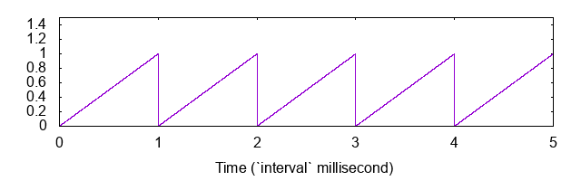
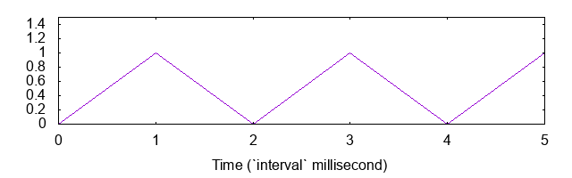

[](https://github.com/semantic-release/semantic-release)

react hooks for "react-native-reanimated"


## Install

```sh
yarn add react-native-reanimated-indicators
```

## Usage

### Examples

- https://github.com/ken0x0a/react-native-reanimated-indicators

```tsx
```

## Utils

### useLoop()

simple loop animation 

value will be looped from `min(default 0)` to `max(default 1)`

```tsx
import { useLoop } from 'react-native-reanimated-hooks'

export const Example: React.FC<ExampleProps> = () => {
  const loop = useLoop()

  const circleStyle = useMemo(() => {
    const size = interpolate(loop.position, { inputRange: [0, 1], outputRange: [20, 70] })

    return { width: size, height: size, backgroundColor: 'pink', borderRadius: size }
  }, [loop.position])

  return (
    <View style={styles.container}>
      <TouchableOpacity
        onPress={loop.toggle} // onPress={() => (loop.isAnimating.current ? loop.stop() : loop.start())}
        style={styles.rect}
      >
        <Animated.View style={rectStyle} />
      </TouchableOpacity>
    </View>
  )
}
```

The loop is the following



**NOT** following



Loop animated values as indicated by name.
Just work as expected.

### ~~useSwitch~~

not works yet.

