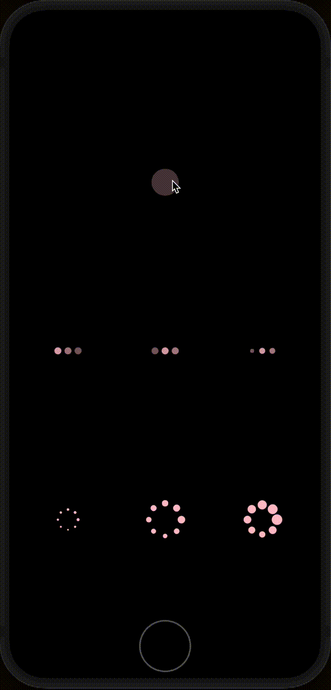

[](https://github.com/ken0x0a/react-native-reanimated-hooks/actions)
[](https://www.npmjs.com/package/react-native-reanimated-hooks)

react hooks for "react-native-reanimated"

<p align="center">

</p>

<sup align="center">

The code for this example is [here](#example).

</sup>


- [Install](#install)
- [Usage](#usage)
  - [useLoop()](#useloop)
- [Example](#example)

## Install

```sh
yarn add react-native-reanimated-indicators
```

## Usage

### useLoop()

simple loop animation 

value will be looped from `min(default 0)` to `max(default 1)`

```tsx
import { interpolate } from 'react-native-reanimated'
import { useLoop } from 'react-native-reanimated-hooks'

export const Example: React.FC<ExampleProps> = () => {
  const loop = useLoop()

  const animatedStyle = useAnimatedStyle(() => {
    const size = interpolate(loop.value.value, [0, 1], [20, 70] )

    return { width: size, height: size, backgroundColor: 'pink', borderRadius: size }
  }, [loop.value])

  return (
    <View style={styles.container}>
      <TouchableOpacity
        onPress={loop.toggle} // onPress={() => (loop.isAnimating.current ? loop.stop() : loop.start())}
        style={styles.rect}
      >
        <Animated.View style={animatedStyle} />
      </TouchableOpacity>
    </View>
  )
}
```

The loop is the following


**NOT** following


Loop animated values as indicated by name.
Just work as expected.

## Example

An example with [react-native-reanimated-indicators](https://github.com/ken0x0a/react-native-reanimated-indicators)

```tsx
import React, { useMemo, useRef } from "react";
import { StyleSheet, Text, TouchableOpacity, View } from "react-native";
import Animated, { interpolate, useAnimatedStyle } from "react-native-reanimated";
import { useLoop } from "react-native-reanimated-hooks";
import { BallIndicator, DotIndicator } from "react-native-reanimated-indicators";

export const IndicatorScreen: React.FC = () => {
  const loop = useLoop();
  const rectStyle = useAnimatedStyle(() => {
    const size = interpolate(loop.value.value, [0, 1], [20, 70]);

    return { width: size, height: size, backgroundColor: "pink", borderRadius: size };
  }, [loop.value]);

  const isAnimating = useRef(true);
  return (
    <View style={styles.container}>
      <Text>IndicatorScreen</Text>
      <TouchableOpacity
        onPress={() => {
          if (isAnimating.current) {
            isAnimating.current = false;
            loop.stop();
          } else {
            isAnimating.current = true;
            loop.start();
          }
        }}
        style={styles.rect}
      >
        <Animated.View style={rectStyle} />
      </TouchableOpacity>
      <View style={styles.indicator}>
        <DotIndicator color="pink" interval={1400} />
        <DotIndicator color="pink" />
        <DotIndicator color="pink" scaleEnabled={true} />
      </View>
      <View style={styles.indicator}>
        <BallIndicator color="pink" dotSize={4} size={30} />
        <BallIndicator color="pink" />
        <BallIndicator color="pink" dotSize={14} />
      </View>
    </View>
  );
};

const styles = StyleSheet.create({
  container: {
    flex: 1,
    backgroundColor: "black",
  },
  rect: {
    flex: 1,
    alignItems: "center",
    justifyContent: "center",
    flexDirection: "row",
  },
  indicator: {
    flex: 1,
    flexDirection: "row",
  },
});
```
